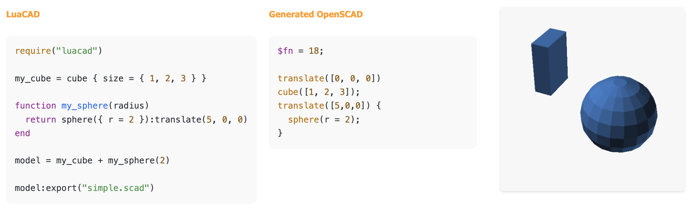

# LuaCAD

LuaCAD is a scripting library which uses [OpenSCAD] as engine
to create 2D and 3D objects.

[OpenSCAD]: https://www.openscad.org/



The LuaCAD library creates [OpenSCAD] code
which is then used to create DXF, SVG, or STL files.


## Installation

- Install OpenSCAD (
      [macOS](https://openscad.org/downloads.html#macos),
      [Linux](https://openscad.org/downloads.html#linux),
      [Windows](https://openscad.org/downloads.html#windows)
    )
- Install LuaJIT
    - macOS: `brew install luajit`
    - Ubuntu: `sudo apt-get install luajit`
    - [Linux](https://luajit.org/install.html#posix)
    - [Windows](https://luajit.org/install.html#windows)
- [Download the project](https://github.com/ad-si/LuaCAD/archive/refs/heads/main.zip)
- Unzip the project
- Change into the new directory: `cd ./LuaCAD-main`
- Create your `<name>.lua` model file (including a `…:export("out.scad")` line)
- Execute code with:
    ```sh
    bin/luacad <name>.lua
    ```
- Open the generated `out.scad` file with OpenSCAD


## Example

**OpenSCAD:**

```openscad
module my_cube() {
  cube(size=[1,2,3]);
}

module my_sphere(radius) {
  translate([5,0,0]) sphere(r = radius);
}

union() {
  my_cube();
  my_sphere(2);
}
```

**LuaCAD:**

```lua
require("luacad")

my_cube = cube { size = { 1, 2, 3 } }

function my_sphere(radius)
  return sphere({ r = radius }):translate(5, 0, 0)
end

model = my_cube + my_sphere(2)

model:export("simple.scad")
```


## Additional Functions

In comparison to OpenSCAD, LuaCAD provides several additional functions
that make it easier to create complex models:

- 2D Objects
    - `ellipse()`
    - `regular_polygon()`
- 3D Objects
    - `cone()` (can use cylinder with different radii)
    - `prism()`
    - `wedge()`
    - `torus()`
    - `surface()`
- Extrusions
    - `rotate_extrude()` with angle parameter
- Mathematical/Programming
    - Most math functions (`cross()`, `norm()`, trigonometric functions)
    - List operations (`len()`, `each`, `range()`)
- Special
    - `import_3mf()`, `rands()`, `search()`


## Why Lua?

The OpenSCAD language is limited and has several issues:

- Confusing functions vs modules
- Weird variable scoping
- Not a well establised programming language
    - Bad editor support
    - Limited documentation
    - Limited libraries
    - Bad error messages
    - Bad performance

Therefore, a *real* programming language should be used
and it should ideally be interpreted and have good
[operator overloading support](https://en.wikipedia.org/wiki/Operator_overloading)

- Julia - Too complex
- Python - Too slow and while easy to get started, hard to master

**… and the winner is Lua 🏆**

- Powerful
- Consistent
- Fast
- Well established
- Easily embeddable and could therefore be directly integrated
    into OpenSCAD or a new CAD software
- Similar syntax to OpenSCAD language
- Already used in other CAD software like [LibreCAD] and [Autodesk Netfabb]

[LibreCAD]: https://wiki.librecad.org/index.php/LibreCAD_3_-_Lua_Scripting
[Autodesk Netfabb]:
  https://help.autodesk.com/view/NETF/2025/ENU/?guid=GUID-93C06838-2623-4573-9BFB-B1EF4628AC4A


## Supported Export Formats

- [SCAD](https://en.wikipedia.org/wiki/OpenSCAD)
- [3MF](https://en.wikipedia.org/wiki/3D_Manufacturing_Format)
- [STL](https://en.wikipedia.org/wiki/STL_(file_format))
- [DXF](https://en.wikipedia.org/wiki/AutoCAD_DXF)
- [OBJ](https://en.wikipedia.org/wiki/Wavefront_.obj_file)
- [SVG](https://en.wikipedia.org/wiki/Scalable_Vector_Graphics)
- [WRL](https://en.wikipedia.org/wiki/VRML)


## Roadmap

- [ ] Full support or [Belfry OpenSCAD Library v2][BOLS2]
- [ ] Support for exporting `.png` files
- [ ] Implement "LuaCAD Studio" GUI desktop app

[BOLS2]: https://github.com/BelfrySCAD/BOSL2/wiki


## Related

Other CAD software that support programmatic creation of 3D models:

- [BlocksCAD] - Blockly-based CAD software
- [FreeCAD] - Python scripting
- [ImplicitCAD] - Haskell-based CAD software
- [LibreCAD] - Lua scripting
- [Liquid CAD] - 2D constraint-solving CAD for rapid prototyping
- [ManifoldCAD] - Online CAD software using JavaScript
- [OpenSCAD Rust] - Rust implementation of the OpenSCAD virtual machine
- [OpenSCAD] - OpenSCAD language

[BlocksCAD]: https://www.blockscad3d.com/editor/
[FreeCAD]: https://wiki.freecad.org/Python_scripting_tutorial
[ImplicitCAD]: https://implicitcad.org/
[Liquid CAD]: https://github.com/twitchyliquid64/liquid-cad
[ManifoldCAD]: https://manifoldcad.org/
[OpenSCAD Rust]: https://github.com/Michael-F-Bryan/scad-rs


## History

The initial work was done by Michael Lutz at
[thechillcode/Lua_CAD](https://github.com/thechillcode/Lua_CAD).


## Related Communities

Platform                  | Members
--------------------------|--------
[r/flossCAD]              |   441
[r/SolveSpace]            |   454
[r/LibreCAD]              |   461
[r/openscad]              |   7 K
[r/3dprint]               |   9 K
[r/AdditiveManufacturing] |  13 K
[r/KiCad]                 |  13 K
[r/Lua]                   |  24 K
[r/FreeCAD]               |  32 K
[r/3dprinter]             |  38 K
[r/AutoCAD]               |  43 K
[r/Creality]              |  46 K
[r/cad]                   |  59 K
[r/prusa3d]               |  84 K
[r/Fusion360]             |  85 K
[r/lasercutting]          |  85 K
[r/SolidWorks]            |  94 K
[r/resinprinting]         |  96 K
[r/fosscad]               | 123 K
[r/MechanicalEngineering] | 184 K
[r/BambuLab]              | 225 K
[r/ender3]                | 237 K
[r/functionalprint]       | 500 K
[r/engineering]           | 668 K
[r/blender]               | 1.3 M
[r/3Dmodeling]            | 1.4 M
[r/3Dprinting]            | 3.0 M
[Hacker News]             | -
[Hackaday]                | -

[Hackaday]: https://hackaday.com
[Hacker News]: https://news.ycombinator.com
[r/3Dmodeling]: https://www.reddit.com/r/3Dmodeling
[r/3dprint]: https://www.reddit.com/r/3dprint
[r/3dprinter]: https://www.reddit.com/r/3dprinter
[r/3Dprinting]: https://www.reddit.com/r/3Dprinting
[r/AdditiveManufacturing]: https://www.reddit.com/r/AdditiveManufacturing
[r/AutoCAD]: https://www.reddit.com/r/AutoCAD
[r/BambuLab]: https://www.reddit.com/r/BambuLab
[r/blender]: https://www.reddit.com/r/blender
[r/cad]: https://www.reddit.com/r/cad/
[r/Creality]: https://www.reddit.com/r/Creality
[r/ender3]: https://www.reddit.com/r/ender3
[r/engineering]: https://www.reddit.com/r/engineering
[r/flossCAD]: https://www.reddit.com/r/flossCAD
[r/fosscad]: https://www.reddit.com/r/fosscad
[r/FreeCAD]: https://www.reddit.com/r/FreeCAD
[r/functionalprint]: https://www.reddit.com/r/functionalprint
[r/Fusion360]: https://www.reddit.com/r/Fusion360
[r/KiCad]: https://www.reddit.com/r/KiCad
[r/lasercutting]: https://www.reddit.com/r/lasercutting
[r/LibreCAD]: https://www.reddit.com/r/LibreCAD
[r/Lua]: https://www.reddit.com/r/Lua
[r/MechanicalEngineering]: https://www.reddit.com/r/MechanicalEngineering
[r/openscad]: https://www.reddit.com/r/openscad/
[r/prusa3d]: https://www.reddit.com/r/prusa3d
[r/resinprinting]: https://www.reddit.com/r/resinprinting
[r/SolidWorks]: https://www.reddit.com/r/SolidWorks
[r/SolveSpace]: https://www.reddit.com/r/SolveSpace


