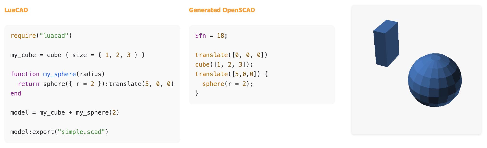
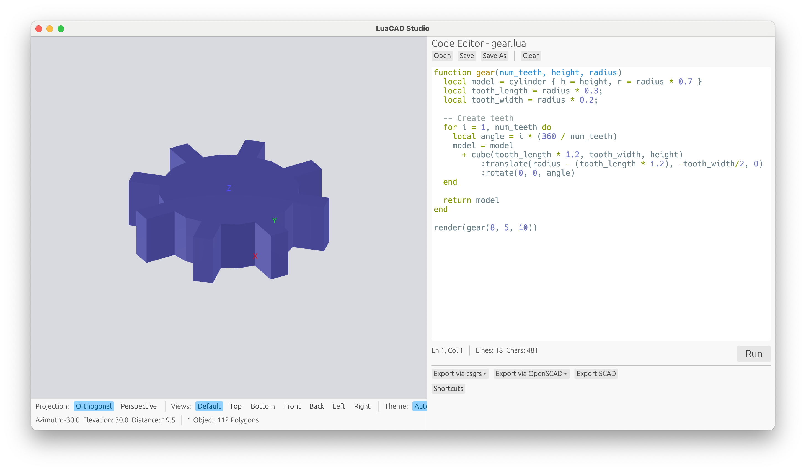

# LuaCAD

Scriptable CAD with Lua.
Write parametric 2D and 3D models in Lua
and export them to STL, 3MF, OBJ, PLY, or SCAD.



LuaCAD embeds Lua 5.4 in a Rust engine
that evaluates CSG operations directly (via [csgrs])
or generates [OpenSCAD] code for external rendering.

[csgrs]: https://github.com/nickmass/csgrs
[OpenSCAD]: https://www.openscad.org/


## Installation

### From source

Requires [Rust](https://www.rust-lang.org/tools/install).

```sh
git clone https://github.com/ad-si/LuaCAD.git
cd LuaCAD
make install
```

This installs two binaries:

- `luacad` -- CLI for running and converting LuaCAD scripts
- `luacad-studio` -- GUI desktop app with live 3D preview




## Usage

### CLI

```sh
luacad convert model.lua output.stl          # Convert to STL
luacad convert model.lua output.3mf          # Convert to 3MF
luacad convert model.lua output.scad         # Export as OpenSCAD
luacad watch model.lua output.stl            # Rebuild on file changes
luacad convert model.lua out.stl --via-openscad  # Use OpenSCAD backend
luacad run model.lua                         # Execute (side-effects only)
```

### Studio

```sh
luacad-studio
```

Desktop app with a code editor and 3D viewport.
Edit Lua code on the right, see the model update on the left.


## Example

```lua
my_cube = cube { size = { 1, 2, 3 } }

function my_sphere(radius)
  return sphere({ r = radius }):translate(5, 0, 0)
end

model = my_cube + my_sphere(2)

render(model)
```

**Equivalent OpenSCAD:**

```openscad
module my_cube() {
  cube(size=[1,2,3]);
}

module my_sphere(radius) {
  translate([5,0,0]) sphere(r = radius);
}

union() {
  my_cube();
  my_sphere(2);
}
```

More examples in the [examples/](examples/) directory.

[Check out the website](https://ad-si.github.io/LuaCAD/openscad-to-luacad.html)
to see all supported features!


## Why Lua?

The OpenSCAD language is limited and has several issues:

- Confusing functions vs modules
- Weird variable scoping
- Not a well establised programming language
    - Bad editor support
    - Limited documentation
    - Limited libraries
    - Bad error messages
    - Bad performance

Therefore, a *real* programming language should be used
and it should ideally be interpreted and have good
[operator overloading support](https://en.wikipedia.org/wiki/Operator_overloading)

- Julia - Too complex
- Python - Too slow and while easy to get started, hard to master

Lua is a better fit:

- Well-established, embeddable language
- Operator overloading for natural CSG syntax (`a + b`, `a - b`)
- Consistent semantics and good performance
- Similar syntax to OpenSCAD's language
- Already used in other CAD software ([LibreCAD], [Autodesk Netfabb])

[LibreCAD]: https://wiki.librecad.org/index.php/LibreCAD_3_-_Lua_Scripting
[Autodesk Netfabb]:
  https://help.autodesk.com/view/NETF/2025/ENU/?guid=GUID-93C06838-2623-4573-9BFB-B1EF4628AC4A


## Supported Export Formats

- [SCAD](https://en.wikipedia.org/wiki/OpenSCAD)
- [3MF](https://en.wikipedia.org/wiki/3D_Manufacturing_Format)
- [STL](https://en.wikipedia.org/wiki/STL_(file_format))
- [DXF](https://en.wikipedia.org/wiki/AutoCAD_DXF)
- [OBJ](https://en.wikipedia.org/wiki/Wavefront_.obj_file)
- [SVG](https://en.wikipedia.org/wiki/Scalable_Vector_Graphics)
- [WRL](https://en.wikipedia.org/wiki/VRML)


## Roadmap

- [ ] Full support for [Belfry OpenSCAD Library v2][BOSL2]
- [ ] Support for exporting `.png` files

[BOSL2]: https://github.com/BelfrySCAD/BOSL2/wiki


## Related

Other CAD software with programmatic model creation:

- [BlocksCAD] - Blockly-based CAD
- [Flowscad] - Rust interface to OpenSCAD
- [FreeCAD] - Python scripting
- [HelloTriangle] - 3D modeling with Python
- [ImplicitCAD] - Haskell-based CAD
- [LibreCAD] - Lua scripting
- [Liquid CAD] - 2D constraint-solving CAD
- [ManifoldCAD] - JavaScript-based online CAD
- [OpenSCAD Rust] - Rust OpenSCAD VM
- [OpenSCAD] - OpenSCAD language
- [Rust Scad] - Generate OpenSCAD from Rust
- [scad_tree] - Rust solid modeling via OpenSCAD
- [ScalaCad] - CSG in Scala
- [SolidRS] - Rust OpenSCAD model generation

[BlocksCAD]: https://www.blockscad3d.com/editor/
[Flowscad]: https://github.com/SmoothDragon/flowscad
[FreeCAD]: https://wiki.freecad.org/Python_scripting_tutorial
[HelloTriangle]: https://www.hellotriangle.io/
[ImplicitCAD]: https://implicitcad.org/
[Liquid CAD]: https://github.com/twitchyliquid64/liquid-cad
[ManifoldCAD]: https://manifoldcad.org/
[OpenSCAD Rust]: https://github.com/Michael-F-Bryan/scad-rs
[Rust Scad]: https://github.com/TheZoq2/Rust-Scad
[scad_tree]: https://github.com/mrclean71774/scad_tree
[ScalaCad]: https://github.com/joewing/ScalaCad
[SolidRS]: https://github.com/MnlPhlp/solidrs


## History

The initial Lua implementation was done by Michael Lutz at
[thechillcode/Lua_CAD](https://github.com/thechillcode/Lua_CAD).
The project was later rewritten in Rust.
