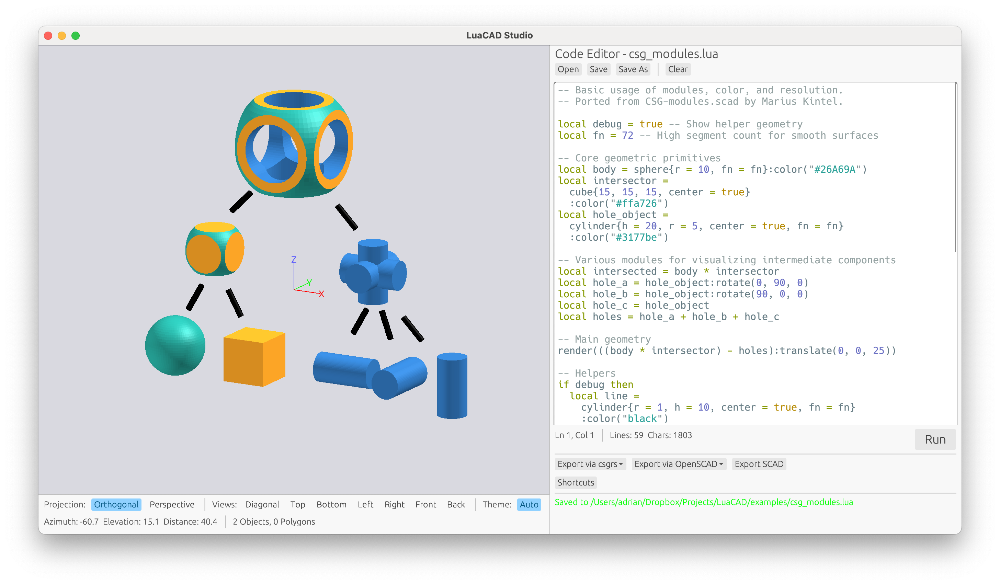

# LuaCAD

Solid 3D CAD modeling with Lua.

Write parametric 2D and 3D models in Lua
and export them to 3MF, STL, OBJ, PLY, OFF, AMF, or SCAD.



LuaCAD embeds Lua 5.4 in a Rust engine
that evaluates CSG operations directly (via [Manifold])
or generates [SCAD] code for external rendering.

[Manifold]: https://github.com/elalish/manifold
[SCAD]: https://openscad.org/documentation.html


## Installation

### Via Crates

```sh
cargo install luacad  # CLI for running and converting LuaCAD scripts
cargo install luacad-studio  # GUI desktop app with live 3D preview
```


### From source

Requires [Rust](https://www.rust-lang.org/tools/install).

```sh
git clone https://github.com/ad-si/LuaCAD.git
cd LuaCAD
make install
```


### Build requirements

Both crates vendor their C/C++ dependencies, so no system libraries need to
be installed — but a C++ compiler and CMake must be available to build them:

- `luacad` builds [Manifold] and Clipper2
- `luacad-studio` additionally builds [OpenCSG], which needs OpenGL
  development headers (on Debian/Ubuntu: `libgl1-mesa-dev`, `libx11-dev`,
  `libxcb1-dev`, `libxkbcommon-dev`, `libxrandr-dev`, `libwayland-dev`)

[OpenCSG]: http://www.opencsg.org/


## Usage

### CLI

```sh
luacad convert model.lua output.3mf   # Convert to 3MF
luacad convert model.lua output.stl   # Convert to STL
luacad convert model.lua output.scad  # Export as SCAD for OpenSCAD
luacad watch model.lua output.3mf     # Rebuild on file changes
luacad run model.lua                  # Execute (side-effects only)
```


### Studio

```sh
luacad-studio
```

Desktop app with a code editor and 3D viewport.
Edit Lua code on the right, see the model update on the left.


## Example

```lua
my_cube = cube { size = { 1, 2, 3 } }

function my_sphere(radius)
  return sphere({ r = radius }):translate(5, 0, 0)
end

model = my_cube + my_sphere(2)

render(model)
```

**Equivalent OpenSCAD:**

```openscad
module my_cube() {
  cube(size=[1,2,3]);
}

module my_sphere(radius) {
  translate([5,0,0]) sphere(r = radius);
}

union() {
  my_cube();
  my_sphere(2);
}
```

More examples in the [examples/](examples/) directory.

[Check out the website](https://ad-si.github.io/LuaCAD/openscad-to-luacad.html)
to see all supported features!

For easier usage, LuaCAD has full support for the
[Belfry OpenSCAD Library v2][BOSL2].
You can use its functions like this:

```lua
bosl.cuboid { {40, 40, 40}, rounding = 2 }
bosl.regular_prism { 5, r = 10, h = 25 }
bosl.spur_gear { circ_pitch = 5, teeth = 20, thickness = 5 }
```

The whole library is reimplemented in LuaCAD, so it renders, previews and
exports to a mesh without OpenSCAD or BOSL2 installed. Exporting to `.scad`
still writes the BOSL2 call itself, which keeps the exported file as short as
the script that produced it.

`surface()`, `scad()` and `import()` of a DXF file do still need OpenSCAD;
`luacad` names them rather than exporting a file without them.

[BOSL2]: https://github.com/BelfrySCAD/BOSL2/wiki


## Why Lua?

The OpenSCAD language is limited and has several issues:

- Confusing functions vs modules
- Weird variable scoping
- Not a well establised programming language
    - Bad editor support
    - Limited documentation
    - Limited libraries
    - Bad error messages
    - Bad performance

Therefore, a *real* programming language should be used
and it should ideally be interpreted and have good
[operator overloading support](https://en.wikipedia.org/wiki/Operator_overloading)

- Julia - Too complex
- Python - Too slow and while easy to get started, hard to master

Lua is a better fit:

- Well-established, embeddable language
- Operator overloading for natural CSG syntax (`a + b`, `a - b`)
- Consistent semantics and good performance
- Similar syntax to OpenSCAD's language
- Already used in other CAD software ([LibreCAD], [Autodesk Netfabb])

[LibreCAD]: https://wiki.librecad.org/index.php/LibreCAD_3_-_Lua_Scripting
[Autodesk Netfabb]:
  https://help.autodesk.com/view/NETF/2025/ENU/?guid=GUID-93C06838-2623-4573-9BFB-B1EF4628AC4A


## Supported Export Formats

- [SCAD](https://en.wikipedia.org/wiki/OpenSCAD)
- [3MF](https://en.wikipedia.org/wiki/3D_Manufacturing_Format)
- [STL](https://en.wikipedia.org/wiki/STL_(file_format))
- [OBJ](https://en.wikipedia.org/wiki/Wavefront_.obj_file)
- [PLY](https://en.wikipedia.org/wiki/PLY_(file_format))
- [OFF](https://en.wikipedia.org/wiki/OFF_(file_format))
- [AMF](https://en.wikipedia.org/wiki/Additive_manufacturing_file_format)

Every value your script returns becomes its own 3MF object,
so slicers like BambuStudio load them as individually movable objects
without needing "Split to Objects".
Label them with `:name(…)` to control how they appear in the object list:

```lua
return
  cube(10, 10, 10):name("base"),
  sphere(6):translate(25, 0, 0):name("knob")
```

The other formats cannot express separate objects,
so they flatten everything into a single mesh.


## Supported Import Formats

`import()` reads every mesh format LuaCAD writes — 3MF, STL, OBJ, PLY, OFF and
AMF — and returns a solid you can transform and combine like any primitive:

```lua
bracket = import("bracket.stl")
render(bracket - cylinder { r = 3, h = 30 }:translate(5, 5, -5))
```

SVG returns a 2D sketch instead, ready to extrude:

```lua
render(import("logo.svg"):linear_extrude(2))
```

Only geometry is read; colors, materials and texture coordinates are dropped.


## Text

`text()` outlines a system font into a sketch, and `text3d()` extrudes it in
one step:

```lua
render(text("LuaCAD", { size = 12, halign = "center" }):linear_extrude(2))
render(text3d("v1.0", { size = 8, depth = 1.5 }))
```

Fonts are looked up by family, optionally with a style — `"DejaVu Sans"` or
`"DejaVu Sans:style=Bold"` — and an unknown family falls back to the default
sans-serif face. Layout is a single line of glyph advances plus kerning pairs;
ligatures and complex scripts need `--via-openscad`, which runs the text
through OpenSCAD's shaping engine instead.


## Related

Other CAD software with programmatic model creation:

- [3DScad] - Visual editor for OpenSCAD-style modeling
- [bevy_editor_cam] - Camera controller for 2D/3D editors and CAD in Bevy
- [BlocksCAD] - Blockly-based CAD
- [CadQuery] - Python module for parametric 3D CAD models
- [Flowscad] - Rust interface to OpenSCAD
- [ForgeCAD] - AI-native CAD for products, manufacturing, and robotics
- [FreeCAD] - Python scripting
- [HelloTriangle] - 3D modeling with Python
- [ImplicitCAD] - Haskell-based CAD
- [LibreCAD] - Lua scripting
- [Liquid CAD] - 2D constraint-solving CAD
- [ManifoldCAD] - JavaScript-based online CAD
- [NassCAD] - Browser-based parametric CAD with JavaScript scripting
- [OpenSCAD Rust] - Rust OpenSCAD VM
- [openscad-rs] - OpenSCAD parser library for Rust
- [OpenSCAD] - OpenSCAD language
- [Rust Scad] - Generate OpenSCAD from Rust
- [scad_tree] - Rust solid modeling via OpenSCAD
- [ScalaCad] - CSG in Scala
- [SolidRS] - Rust OpenSCAD model generation
- [SpaceCAD] - Model rocket design and simulation software
- [SynapsCAD] - AI-powered 3D CAD IDE

[3DScad]: https://github.com/42ne/3dscad
[bevy_editor_cam]: https://github.com/aevyrie/bevy_editor_cam
[BlocksCAD]: https://www.blockscad3d.com/editor/
[CadQuery]: https://github.com/CadQuery/cadquery
[Flowscad]: https://github.com/SmoothDragon/flowscad
[ForgeCAD]: https://forgecad.io/
[FreeCAD]: https://wiki.freecad.org/Python_scripting_tutorial
[HelloTriangle]: https://www.hellotriangle.io/
[ImplicitCAD]: https://implicitcad.org/
[Liquid CAD]: https://github.com/twitchyliquid64/liquid-cad
[ManifoldCAD]: https://manifoldcad.org/
[NassCAD]: https://www.nasscad.com/
[OpenSCAD Rust]: https://github.com/Michael-F-Bryan/scad-rs
[openscad-rs]: https://github.com/ierror/openscad-rs
[OpenSCAD]: https://openscad.org
[Rust Scad]: https://github.com/TheZoq2/Rust-Scad
[scad_tree]: https://github.com/mrclean71774/scad_tree
[ScalaCad]: https://github.com/joewing/ScalaCad
[SolidRS]: https://github.com/MnlPhlp/solidrs
[SpaceCAD]: https://www.spacecad.de/
[SynapsCAD]: https://github.com/ierror/synaps-cad


## History

The initial Lua implementation was done by Michael Lutz at
[thechillcode/Lua_CAD](https://github.com/thechillcode/Lua_CAD).
The project was later rewritten in Rust.
