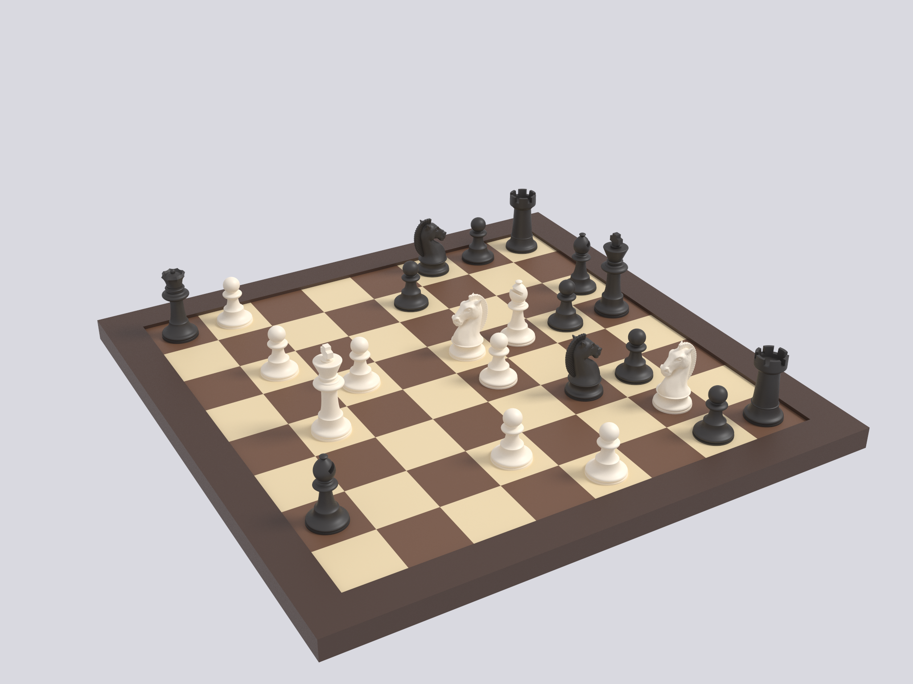

# Chess

A game in progress, set up from a FEN string — written in OpenSCAD, not Lua,
and meshed and lit by LuaCAD without OpenSCAD installed.



```sh
luacad render --raytrace chess.scad chess_raytraced.png
luacad render            chess.scad chess.png
luacad convert           chess.scad chess.3mf
```

23 pieces on a 296 mm board, 234k triangles, about half a second to build.

## The position

The **Immortal Game** — Adolf Anderssen vs Lionel Kieseritzky, London, 21 June
1851 — after Black's 22nd move:

```
1. e4   e5     2. f4   exf4   3. Bc4  Qh4+   4. Kf1  b5
5. Bxb5 Nf6    6. Nf3  Qh6    7. d3   Nh5    8. Nh4  Qg5
9. Nf5  c6    10. g4   Nf6   11. Rg1  cxb5  12. h4   Qg6
13. h5  Qg5   14. Qf3  Ng8   15. Bxf4 Qf6   16. Nc3  Bc5
17. Nd5 Qxb2  18. Bd6  Bxg1  19. e5   Qxa1+ 20. Ke2  Na6
21. Nxg7+ Kd8 22. Qf6+ Nxf6  23. Be7#
```

White is to move, a bishop, both rooks and the queen down, and mates with
**23.Be7#**. Black's queen stands on a1 and his bishop on g1 — the two squares
White's rooks started on.

```
  a b c d e f g h
8 r . b k . . . r 8      r n b q k b n r   black,  lowercase
7 p . . p . p N p 7      R N B Q K B N R   white,  uppercase
6 n . . B . n . . 6
5 . p . N P . . P 5      White: Ke2 Bd6 Nd5 Ng7
4 . . . . . . P . 4             a2 c2 d3 e5 g4 h5
3 . . . P . . . . 3      Black: Kd8 Qa1 Ra8 Rh8 Bc8 Bg1 Na6 Nf6
2 P . P . K . . . 2             a7 b5 d7 f7 h7
1 q . . . . . b . 1
  a b c d e f g h
```

Set `POSITION` in `chess.scad` to any other FEN to lay out a different game.
Only the piece-placement field is read, so both the bare board and a full
six-field FEN work:

```openscad
POSITION = "r1bk3r/p2p1pNp/n2B1n2/1p1NP2P/6P1/3P4/P1P1K3/q5b1 w - - 0 23";
```

Parsing it is a recursive function over the string — `placement()` in
`chess.scad` walks one character at a time, resetting the file on `/`,
skipping ahead on a digit, and emitting `[file, rank, letter]` on a letter.
`search()` does the character-class tests and folds the two cases together, so
`P` and `p` reach the same `pawn()` module by different colours.

## Layout

| File | Contents |
| --- | --- |
| `chess.scad` | Entry point: the FEN, its parser, and the placement loop |
| `parts/board.scad` | 64 inlaid tiles and the frame around them |
| `parts/pieces.scad` | The six pieces |
| `profiles/` | The SVG profiles and STL meshes the pieces are built from |

Each piece is a lathe: a profile drawn in Inkscape, imported from SVG and spun
with `rotate_extrude`. The rook loses turret crenellations to a boolean and the
bishop its mitre slot; the knight's head and the queen's crown are STL meshes
sitting on the lathed body. So a single file exercises SVG import, mesh import,
both extrusions, booleans, string handling and recursion.

Every piece is 20 mm across the base and stands on z = 0, which is also the
playing surface, so the board's 32 mm squares leave 6 mm of margin all round.
a1 comes out dark, as it must.

`import()` paths are written the way `chess.scad` sees them, because LuaCAD
resolves an import against the directory of the file it was asked to render
rather than the file the call sits in. Render `chess.scad`; the two files under
`parts/` are libraries and will not find `profiles/` on their own.

## Credit

The pieces are from [quaternionmedia/scad-chess][scad-chess] by Quaternion
Media, licensed [CC-BY-4.0][cc-by]; the licence text is in
`profiles/LICENSE`. `parts/pieces.scad` is their `chess_*.scad` merged into
one file with the profile paths repointed, and `rook()`'s crenellation loop
narrowed from `[0 : cutouts]` to `[0 : cutouts - 1]` — the original places the
first and last wedge at the same angle, so this cuts the same shape with one
boolean fewer. The board, the FEN parser and the position are new.

[scad-chess]: https://github.com/quaternionmedia/scad-chess
[cc-by]: https://creativecommons.org/licenses/by/4.0/
