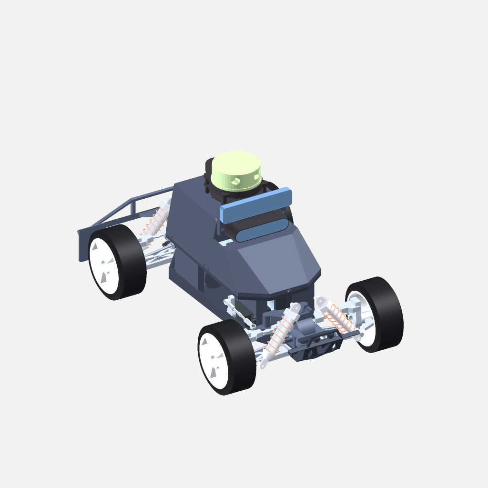

# MuSHR Racecar

A LuaCAD port of the [MuSHR](https://mushr.io) open-source robotic racecar
from the University of Washington Personal Robotics Lab.



Converted from the OpenSCAD original at
[prl-mushr/mushr_cad](https://github.com/prl-mushr/mushr_cad), which is
BSD-3-Clause licensed.

## Building it

```sh
luacad convert racecar.lua racecar.3mf --via-manifold   # coloured assembly
luacad render  racecar.lua racecar.png                  # quick preview
```

Every part is exported as its own named, coloured object, so the 3MF opens
as an assembly rather than one welded lump. The whole car builds in a few
seconds.

To work on one part at a time, require its module directly:

```lua
package.path = "./?.lua;" .. package.path
render(require("parts.wheel").hub())
```

## Layout

| File | Contents |
| --- | --- |
| `racecar.lua` | Top level: renders body then chassis |
| `parts/utils.lua` | Shared primitives — fasteners, trapezoids, springs |
| `parts/palette.lua` | The colour scheme |
| `parts/platform.lua` | The 374 mm chassis plate and its nose cone |
| `parts/gearbox.lua` | Gearbox housings, steering rack, motor cover |
| `parts/wheel.lua` | Tyre, hub and upright |
| `parts/suspension.lua` | Control arms, turnbuckles, drive shafts |
| `parts/shock_tower.lua` | Coil-over dampers (body and spring separately) |
| `parts/back_bumper.lua` | Rear bumper assembly |
| `parts/chassis.lua` | Rolling chassis assembly |
| `parts/crossbar.lua` | The spine carrying the upper structure |
| `parts/foundation_support.lua` | Pillars standing the trays off the crossbar |
| `parts/servo_cage.lua` | Steering servo enclosure |
| `parts/back_foundation.lua` | Rear electronics tray |
| `parts/front_foundation.lua` | Front electronics tray |
| `parts/back_cover.lua` | Rear bodywork |
| `parts/front_cover.lua` | Nose bodywork and the camera bay |
| `parts/electronics.lua` | Servo, batteries, Jetson Nano, cameras, lidar |
| `parts/body.lua` | Upper assembly |

## Differences from the original

- **The DXF logo and text insets are dropped.** The original mills a
  university logo into each rear side panel, lettering into the two front
  side panels, and a race number into the nose. Everything else is
  geometrically identical.
- **Parts are coloured.** The original is monochrome apart from a single
  `color()` call on the D435's lens.
- Three OpenSCAD quirks are reproduced rather than corrected, and flagged
  in comments where they occur: a stray X offset folded into the shock
  towers' Z placement, `_spec_trap`'s inconsistent face list, and a
  denominator in the nose's right-hand slope that mixes a *y* coordinate
  into an *x* difference.

### Warped faces

Several bodywork panels have quadrilateral faces whose four corners are
not coplanar. That is invalid input to `polyhedron` — the enclosed volume
depends on which diagonal the quad is split along, and the two answers
differ by up to 1.3% of the panel. Rather than depend on a tessellator's
tie-break, every warped quad is written out as two explicit triangles,
picking the diagonal the original produces. Look for the comments that say
"warped quad".

## Verifying against the original

Every part was checked against an OpenSCAD render of the same module by
exporting both to STL and comparing signed volume and bounding box. All
match to within rounding, except where tessellation conventions differ on
spheres and helices (worst case 0.65% on a quarter sphere, 1.6% on the
coil spring, both converging as facet count rises). The panels carrying
dropped decals were checked against references with those decals removed.

Use signed volume, not `abs()` — an inside-out solid has the right
magnitude and the wrong sign, and unions it should contribute to will
silently subtract instead.
